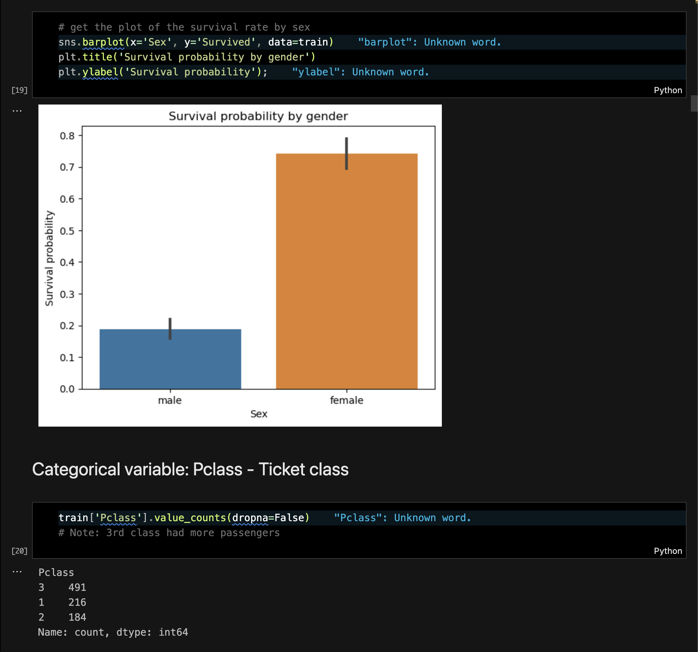

# Titanic Disaster Analysis

An in-depth data analysis project focused on the Titanic disaster. This project involves data cleaning, visualization, and machine learning to predict survival rates and uncover significant patterns from the dataset. It includes advanced techniques such as hyperparameter tuning and model evaluation.

---

## 📸 Screenshots

---

## ✨ Features

- Data Wrangling: Comprehensive preprocessing using Pandas, NumPy, and Missingno to handle missing values and optimize datasets.
- Data Visualization: Insightful visualizations with Seaborn and Matplotlib for better understanding of trends and patterns.
- Machine Learning Models: Implementation of various classifiers such as Logistic Regression, Random Forest, SVM, and CatBoost to predict survival outcomes.
- Model Evaluation: Performance assessment using cross-validation and metrics analysis.
- Hyperparameter Tuning: GridSearchCV applied for fine-tuning model parameters to achieve better accuracy.

---

## ⚙️ Tech Stack

- Pandas, NumPy: For data manipulation and cleaning.
- Missingno: For handling and visualizing missing data.
- Seaborn, Matplotlib: For plotting and data visualization.
- Scikit-learn: For machine learning models, evaluation, and tuning.
- CatBoost: Advanced gradient boosting for classification tasks.
